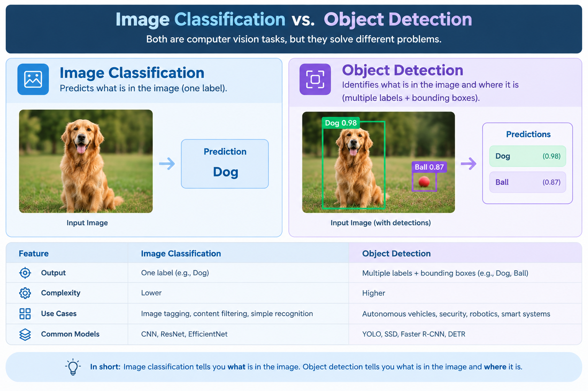

# Image Classification vs. Object Detection

## Introduction

Computer vision enables computers to understand and analyze visual information such as images and videos. Two common computer vision tasks are **image classification** and **object detection**.

Although both tasks identify objects in images, they provide different types of information.

In this article, we will understand what image classification and object detection are, how they work, their differences, and their real-world applications.

## What Is Image Classification?

**Image classification** is a computer vision task that assigns a label or category to an image.

For example, if we provide an image of a dog to a classification model, the model may predict:

**Dog**

The model focuses on identifying **what the image contains**.

### Example

Suppose we have three categories:

- Cat
- Dog
- Horse

When an image is given to the model, it predicts one of these categories based on the visual patterns it has learned.

### Applications of Image Classification

Image classification can be used for:

- Animal recognition
- Product categorization
- Medical image analysis
- Plant disease detection
- Document classification
- Image organization

## What Is Object Detection?

**Object detection** identifies objects within an image and determines their locations.

Unlike image classification, object detection can identify **multiple objects in the same image**.

For example, an image of a road may contain:

- Cars
- Buses
- Pedestrians
- Traffic signs

An object detection model can identify these objects and draw **bounding boxes** around them.

### Example

If an image contains two cars and one person, an object detection system may produce:

- Car — bounding box
- Car — bounding box
- Person — bounding box

Therefore, object detection answers two questions:

**What objects are present?**

**Where are they located?**

## Key Difference

The main difference is the type of output produced.

**Image classification:**

> What is in the image?

**Object detection:**

> What objects are in the image, and where are they?

For example, consider an image containing a dog and a ball.

An image classification model might classify the image as:

**Dog and Ball**

An object detection model can identify both objects and show their locations using bounding boxes.

## How They Work

### Image Classification

A simplified classification workflow is:

**Image → Preprocessing → Classification Model → Class Label**

The model analyzes the image and predicts the most appropriate category.

### Object Detection

A simplified object detection workflow is:

**Image → Preprocessing → Detection Model → Objects + Locations**

The model identifies objects and their positions within the image.

## Image Classification vs. Object Detection: Comparison

| Feature | Image Classification | Object Detection |
|---|---|---|
| Main purpose | Classify an image | Detect objects in an image |
| Output | Class label | Object labels + locations |
| Multiple objects | Overall image label | Can detect multiple objects |
| Location information | No | Yes |
| Bounding boxes | No | Yes |
| Complexity | Generally simpler | Generally more complex |
| Example | Cat vs. Dog | Detect cats and dogs and locate them |

## Real-World Applications

### Image Classification

Image classification is useful when the main goal is to determine the category of an image.

Examples include:

- Identifying whether a medical image shows a particular condition
- Categorizing products
- Recognizing plant diseases
- Classifying documents
- Sorting images automatically

### Object Detection

Object detection is useful when both the object and its location are important.

Examples include:

- Detecting vehicles on roads
- Identifying pedestrians
- Sports image and video analysis
- Security monitoring
- Detecting defects in manufacturing
- Identifying products in retail environments

## When Should You Use Each?

Use **image classification** when you only need to know what category an image belongs to.

For example:

> Is this image a cat or a dog?

Use **object detection** when you need to identify individual objects and locate them within the image.

For example:

> Where are the cars and pedestrians in this image?

Choosing the appropriate computer vision task depends on the problem you are trying to solve and the type of output you need.

## Conclusion

Image classification and object detection are both important computer vision tasks, but they solve different problems.

**Image classification** determines the category of an image, while **object detection** identifies individual objects and their locations.

Understanding this difference is important when designing computer vision applications because the required task depends on the information that needs to be extracted from the visual data.

## Related Articles

- [What Is Computer Vision? — A Beginner-Friendly Guide](01-what-is-computer-vision.md)
- [How Does OCR Work? — A Beginner-Friendly Guide](03-how-ocr-works.md)

## References

- OpenCV Documentation
- Google Cloud Vision AI Documentation
- Tesseract OCR Documentation
