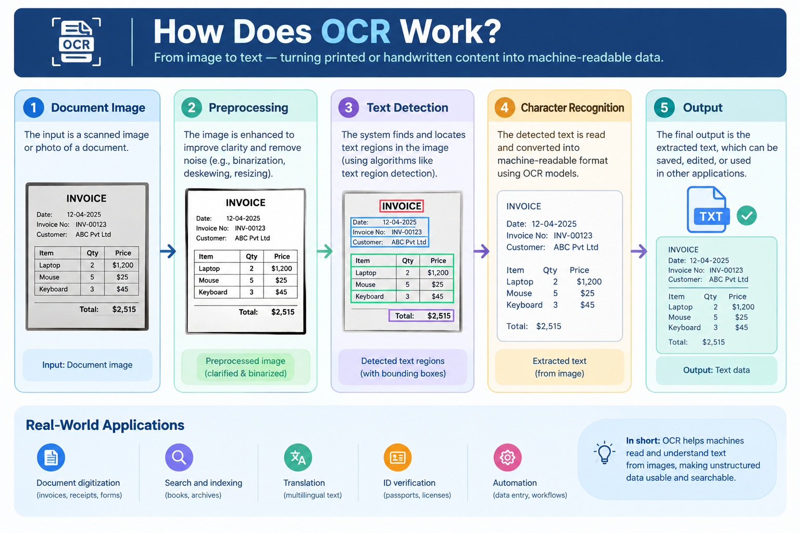

# How Does OCR Work? — A Beginner-Friendly Guide

## Introduction

Have you ever taken a photo of a document and wondered how an application can recognize the words inside it?

This is possible with **Optical Character Recognition (OCR)**.

OCR is a technology that enables computers to identify and extract text from images, scanned documents, photographs, and other visual sources.

Instead of manually typing the information from an image, OCR can convert the text into machine-readable data that can be searched, edited, stored, or processed by software.

In this article, we will understand **what OCR is, how OCR works, the main steps involved, its applications, and its limitations**.

## What Is OCR?

**Optical Character Recognition (OCR)** is a technology used to recognize text from images or scanned documents and convert it into digital text.

For example, consider an image containing:

**Invoice Number: 12345**

An OCR system can analyze the image and extract:

`Invoice Number: 12345`

The extracted text can then be copied, searched, stored in a database, or processed by another application.

OCR is commonly used for documents such as:

- Invoices
- Receipts
- Identity documents
- Books
- Forms
- Certificates
- Printed reports

## How Does OCR Work?

A basic OCR system follows several steps to convert an image into readable text.

A simplified workflow is:

**Image → Preprocessing → Text Detection → Character Recognition → Extracted Text**

Let's look at each step.

## 1. Image Input

The OCR process begins with an image containing text.

The image may come from:

- A scanned document
- A mobile phone camera
- A photograph
- A PDF document
- A digital image

The quality of the input image can have a significant effect on the OCR result.

## 2. Image Preprocessing

Before recognizing the text, the image is often processed to improve its quality.

Common preprocessing techniques include:

- Grayscale conversion
- Noise removal
- Thresholding
- Resizing
- Contrast adjustment
- Image sharpening

For example, converting a color document into grayscale can simplify the image and make the text easier to analyze.

### Example

A simple preprocessing workflow can be:

**Original Image → Grayscale → Noise Removal → Thresholding → OCR**

Good preprocessing can improve the quality of the text recognition process.

## 3. Text Detection

After preprocessing, the OCR system needs to identify where the text appears in the image.

For example, a document may contain:

- A heading
- Paragraphs
- Tables
- Numbers
- Labels

The OCR system analyzes the image to locate regions that contain text.

## 4. Character Recognition

Once the text regions are identified, the OCR system recognizes the characters.

Traditional OCR systems use image-processing techniques and pattern recognition methods.

Modern OCR systems can use **machine learning and deep learning** to recognize different fonts, characters, layouts, and text styles.

The system analyzes visual patterns and predicts which characters or words they represent.

## 5. Extracted Text

Finally, the recognized text is returned as digital text.

For example:

**Image:**

`Name: Nandhitha`

**OCR Output:**

`Name: Nandhitha`

The extracted text can then be displayed, stored, edited, or processed by another application.

## OCR Pipeline

A complete OCR pipeline can be represented as:

**Input Image**

↓

**Image Preprocessing**

↓

**Text Detection**

↓

**Character Recognition**

↓

**Text Extraction**

↓

**Digital Text**

Each stage contributes to the final OCR result.

## OCR and Computer Vision

OCR is closely related to **computer vision** because it involves analyzing visual information.

Computer vision focuses on enabling computers to understand images and videos, while OCR specifically focuses on recognizing and extracting text from visual data.

For example:

**Computer Vision:**  
Identifies objects, shapes, people, or other visual information.

**OCR:**  
Identifies and extracts text from images.

OCR can therefore be considered an important application of computer vision.

## Real-World Applications of OCR

OCR is used in many industries and everyday applications.

### Document Digitization

Organizations can use OCR to convert scanned documents and printed records into searchable digital text.

### Invoice Processing

OCR can extract information such as:

- Invoice numbers
- Dates
- Customer names
- Product details
- Amounts

This can reduce the need for manual data entry.

### Receipt Scanning

Mobile applications can use OCR to extract information from receipts for expense tracking and record keeping.

### Identity Documents

OCR can extract information from documents such as passports, licenses, and identification cards.

### Books and Archives

Libraries and organizations can use OCR to convert printed books and historical documents into searchable digital formats.

### Forms Processing

OCR can help extract information from printed forms and documents.

## OCR Using Python

Python provides several libraries and tools that can be used to build OCR applications.

One commonly used OCR engine is **Tesseract**.

Python can interact with Tesseract through libraries such as `pytesseract`.

Image-processing libraries such as **OpenCV** can also be used to preprocess images before sending them to the OCR engine.

A simplified Python OCR workflow is:

**Image → OpenCV Preprocessing → Tesseract OCR → Extracted Text**

This combination can be useful for building document scanning and text extraction applications.

## Challenges of OCR

Although OCR is useful, it does not always produce perfect results.

### Poor Image Quality

Blurred, noisy, or low-resolution images can reduce recognition accuracy.

### Complex Backgrounds

Text placed on complex backgrounds can be difficult to recognize.

### Unusual Fonts

Decorative or unusual fonts may be harder for OCR systems to interpret correctly.

### Handwritten Text

Handwriting can be more difficult to recognize because writing styles vary significantly between people.

### Incorrect Lighting

Photographs taken under poor lighting conditions may affect text recognition.

### Document Layout

Tables, columns, rotated text, and complex document structures can make OCR more challenging.

## How to Improve OCR Accuracy

Several techniques can help improve OCR results.

### Improve Image Quality

Use clear, high-resolution images whenever possible.

### Apply Preprocessing

Techniques such as grayscale conversion, thresholding, noise removal, and resizing can improve the input image.

### Correct Image Orientation

Make sure the text is properly aligned before performing OCR.

### Use Suitable OCR Models

Different OCR tools and models may perform better for different languages, fonts, and document types.

## Conclusion

Optical Character Recognition is a technology that enables computers to extract text from images and scanned documents.

A typical OCR system follows a pipeline of **image input, preprocessing, text detection, character recognition, and text extraction**.

OCR has many practical applications, including document digitization, invoice processing, receipt scanning, identity document processing, and forms processing.

By combining **Python, OpenCV, and Tesseract**, developers can build applications that automatically process documents and extract useful information from images.

As computer vision and artificial intelligence continue to develop, OCR technology is becoming increasingly useful for automating document-based tasks.

## Related Articles

- [What Is Computer Vision? — A Beginner-Friendly Guide](01-what-is-computer-vision.md)
- [Image Classification vs. Object Detection](02-image-classification-vs-object-detection.md)

## References

- Tesseract OCR Documentation
- OpenCV Documentation
- Google Cloud Vision AI Documentation
